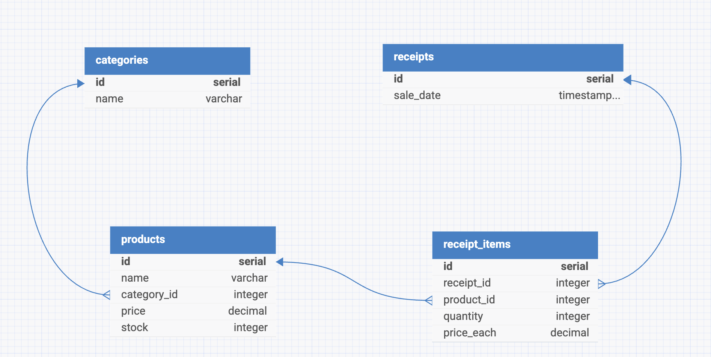

# 🛍️ Shopping REST Service

> Веб-приложение для автоматизации процесса покупки и учёта товаров в магазине.  
> Backend: **Java + Spring MVC + JDBC** | Frontend: **HTML/CSS/JS** | БД: **PostgreSQL**

---

## 📋 Описание задачи

Разработать систему, автоматизирующую процесс покупки и учёта товаров в магазине:

- Товары описываются **названием, категорией, ценой за 1 ед., количеством на складе**
- Покупатель может купить один или несколько товаров разных категорий в количестве **не более остатка на складе**
- Система рассчитывает **стоимость покупки** с указанием даты продажи, id чека, перечня купленного и количества
- Администратор может получить **количество каждого проданного товара за выбранную дату** и **выручку за эту дату**
- Для взаимодействия с пользователем разработан **GUI (веб-интерфейс)**

---

## 🗄️ Схема данных


### Таблицы

| Таблица | Описание |
|---|---|
| `categories` | Категории товаров |
| `products` | Товары с ценой и остатком на складе |
| `receipts` | Чеки — факт совершения покупки |
| `receipt_items` | Позиции чека — конкретные товары в покупке |

---

## 🗃️ SQL — Создание таблиц

```sql
CREATE TABLE categories (
    id   SERIAL PRIMARY KEY,
    name VARCHAR(100) NOT NULL UNIQUE
);

CREATE TABLE products (
    id          SERIAL PRIMARY KEY,
    name        VARCHAR(200) NOT NULL,
    category_id INT REFERENCES categories(id),
    price       NUMERIC(10,2) NOT NULL,
    stock       INT NOT NULL CHECK (stock >= 0)
);

CREATE TABLE receipts (
    id        SERIAL PRIMARY KEY,
    sale_date TIMESTAMP DEFAULT NOW()
);

CREATE TABLE receipt_items (
    id         SERIAL PRIMARY KEY,
    receipt_id INT REFERENCES receipts(id),
    product_id INT REFERENCES products(id),
    quantity   INT NOT NULL CHECK (quantity > 0),
    price_each NUMERIC(10,2) NOT NULL
);
```

---

## 🔍 SQL — Основные запросы

### Все товары с категориями
```sql
SELECT p.id, p.name, c.id as category_id, c.name as category_name,
       p.price, p.stock
FROM products p
JOIN categories c ON c.id = p.category_id;
```

### Товары по категории
```sql
SELECT p.id, p.name, c.id as category_id, c.name as category_name,
       p.price, p.stock
FROM products p
JOIN categories c ON c.id = p.category_id
WHERE c.id = ?;
```

### Сумма конкретного чека
```sql
SELECT SUM(ri.quantity * ri.price_each) AS total
FROM receipt_items ri
WHERE ri.receipt_id = ?;
```

### Выручка за выбранную дату
```sql
SELECT SUM(ri.quantity * ri.price_each) AS revenue
FROM receipt_items ri
JOIN receipts r ON r.id = ri.receipt_id
WHERE DATE(r.sale_date) = ?;
```

### Количество каждого проданного товара за дату
```sql
SELECT p.name, SUM(ri.quantity) AS total_sold
FROM receipt_items ri
JOIN receipts r ON r.id = ri.receipt_id
JOIN products p ON p.id = ri.product_id
WHERE DATE(r.sale_date) = ?
GROUP BY p.name
ORDER BY total_sold DESC;
```

### Списание остатка при покупке
```sql
UPDATE products SET stock = stock - ? WHERE id = ?;
```

---

## 🏗️ Архитектура проекта

```
src/main/java/ru/starashchuk/shopping/service/
│
├── configs/
│   ├── SpringConfig.java                  — конфигурация Spring MVC
│   ├── SecurityConfig.java                — конфигурация Spring Security
│   └── MySpringDispatcherServletInitializer.java
│
├── controllers/
│   ├── ProductController.java             — ручки товаров
│   ├── CategoryController.java            — ручки категорий
│   ├── PurchaseController.java            — ручка покупки
│   └── ReportController.java             — ручки отчётов (admin)
│
├── DAO/
│   ├── ProductDAO.java                    — SQL запросы для товаров
│   ├── CategoryDAO.java                   — SQL запросы для категорий
│   ├── ReceiptDAO.java                    — SQL запросы для чеков
│   ├── ReceiptItemDAO.java               — SQL запросы для позиций чека
│   └── ReportDAO.java                    — SQL запросы для отчётов
│
├── services/
│   ├── ProductService.java               — бизнес-логика товаров
│   ├── CategoryService.java              — бизнес-логика категорий
│   ├── PurchaseService.java              — бизнес-логика покупки + транзакция
│   └── ReportService.java               — бизнес-логика отчётов
│
├── models/
│   ├── Product.java
│   ├── Category.java
│   ├── Receipt.java
│   └── ReceiptItem.java
│
├── DTO/
│   ├── PurchaseRequestDTO.java           — запрос на покупку
│   ├── PurchaseItemDTO.java              — позиция в запросе
│   ├── PurchaseResponseDTO.java          — ответ с чеком
│   ├── ReceiptItemDTO.java               — позиция в ответе
│   └── SoldItemDTO.java                  — позиция в отчёте
│
├── exceptions/
│   ├── ProductNotFoundException.java
│   ├── InsufficientStockException.java
│   ├── ReceiptCreationException.java
│   ├── DatabaseException.java
│   └── GlobalExceptionHandler.java
│
└── db/
    └── DBConnection.java                 — подключение к PostgreSQL
```

---

## 🔌 REST API

### Покупатель

| Метод | URL | Описание |
|---|---|---|
| `GET` | `/categories` | Получить все категории |
| `GET` | `/products` | Получить все товары |
| `GET` | `/products/{id}` | Получить товар по ID |
| `GET` | `/products?categoryId={id}` | Получить товары по категории |
| `POST` | `/purchases` | Оформить покупку |

### Администратор

| Метод | URL | Описание |
|---|---|---|
| `GET` | `/admin/reports/revenue?date=YYYY-MM-DD` | Выручка за дату |
| `GET` | `/admin/reports/sold?date=YYYY-MM-DD` | Продажи за дату |

---

## 📦 Пример запроса покупки

**Запрос:**
```http
POST /purchases
Content-Type: application/json

{
  "items": [
    { "productId": 1, "quantity": 2 },
    { "productId": 3, "quantity": 1 }
  ]
}
```

**Ответ:**
```json
{
  "receiptId": 42,
  "saleDate": "2024-01-15T14:30:00",
  "items": [
    {
      "productName": "Молоко 3.2% 1л",
      "quantity": 2,
      "priceEach": 89.99,
      "itemTotal": 179.98
    },
    {
      "productName": "Хлеб белый",
      "quantity": 1,
      "priceEach": 45.00,
      "itemTotal": 45.00
    }
  ],
  "total": 224.98
}
```

---

## 🔐 Безопасность

Отчёты доступны только администратору через **HTTP Basic Auth**.  
Все остальные эндпоинты открыты для всех пользователей.

```
Логин: задаётся в application.properties
Пароль: задаётся в application.properties
```

---

## ⚙️ Конфигурация

Создать файл `src/main/resources/application.properties`:

```properties
# БД
db.url=jdbc:postgresql://localhost:5432/shopping_db
db.username=postgres
db.password=yourpassword

# Админ
admin.username=admin
admin.password=yourpassword
```

> ⚠️ Файл добавлен в `.gitignore` — не попадает в репозиторий

---

## 🚀 Запуск

### Требования
- Java 17+
- Maven 3.8+
- PostgreSQL 14+
- Apache Tomcat 11

### Шаги

```bash
# 1. Клонировать репозиторий
git clone https://github.com/devstarash/Shopping-REST-Service.git

# 2. Создать БД и таблицы
psql -U postgres -f schema.sql

# 3. Заполнить тестовыми данными
psql -U postgres -f data.sql

# 4. Создать application.properties

# 5. Собрать проект
mvn clean package

# 6. Задеплоить war в Tomcat
cp target/shopping-rest-service.war $TOMCAT_HOME/webapps/
```

### Открыть в браузере
```
Магазин:      http://localhost:8080/index.html
Админ панель: http://localhost:8080/admin.html
```

---

## 🖥️ GUI

### Магазин (`index.html`)
- Просмотр каталога товаров с фильтрацией по категориям
- Добавление товаров в корзину с управлением количеством прямо на карточке
- Оформление покупки с выводом чека

### Админ панель (`admin.html`)
- Авторизация по логину и паролю
- Выбор даты для просмотра отчёта
- Карточки с выручкой, количеством наименований и лидером продаж
- Таблица продаж с рейтингом и прогресс-барами

---

## 🛠️ Стек технологий

| Слой | Технология |
|---|---|
| Backend | Java 17, Spring MVC 6.x, JDBC |
| База данных | PostgreSQL |
| Безопасность | Spring Security 6.x |
| Frontend | HTML, CSS, Vanilla JS |
| Сборка | Maven |
| Сервер | Apache Tomcat 10 |
