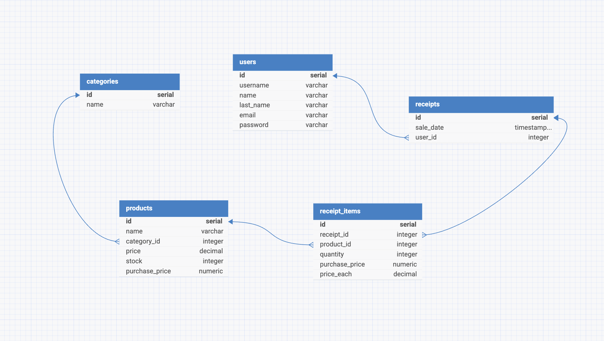
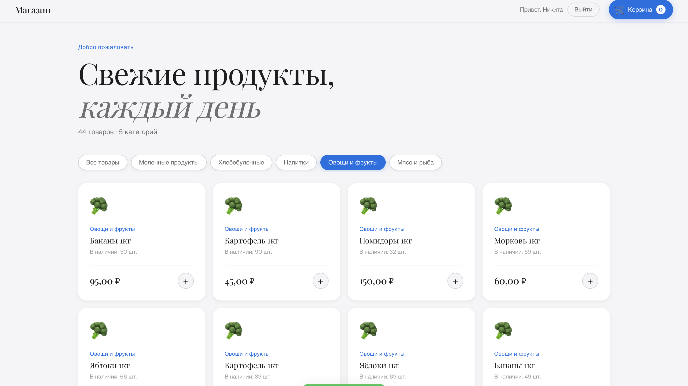
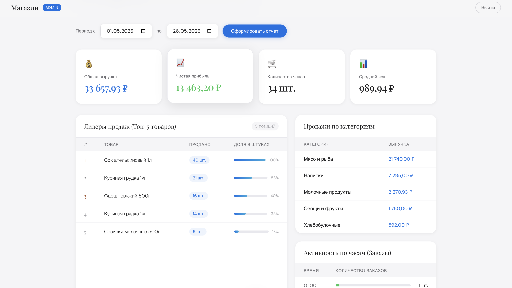

# 🛒 Shopping Service

> **Учебный проект** — Автоматизированная система управления супермаркетом.  
> Тема: **Супермаркет** | Дисциплина: Технология создания ИС

---

## 📋 Описание проекта

**Shopping Service** — это веб-приложение на базе Spring Framework, реализующее систему автоматизации работы розничного магазина (супермаркета). Проект охватывает полный цикл: от регистрации пользователей и просмотра каталога товаров до оформления покупок, автоматической отправки чеков на email и формирования аналитических отчётов для администратора.

Система разделена на два интерфейса:
- **Клиентская часть** (`/`) — каталог товаров, корзина, оформление покупки
- **Административная панель** (`/admin`) — аналитика продаж, отчёты, бизнес-показатели

---

## 🎯 Целевая аудитория

| Роль | Задачи |
|---|---|
| **Покупатель** | Регистрация, просмотр каталога, оформление покупок, получение чека на email |
| **Администратор** | Просмотр аналитики продаж, отчёты по категориям, топ товаров, почасовые графики, бизнес-итоги |

---

## 🏪 Аналоги на рынке ПО

На рынке существует несколько систем автоматизации розничной торговли. Ниже приведено сравнение с основными аналогами.

### 1С:Розница

**СУБД:** Microsoft SQL Server / PostgreSQL (по выбору)  
**Архитектура:** Клиент-серверная (толстый клиент). Десктопное приложение на платформе 1С:Предприятие, работает локально или через Remote Desktop.

**Функциональные возможности:**
- Управление товарным каталогом, складом, ценообразованием
- Кассовые операции, интеграция с фискальным оборудованием (ФФД, ОФД)
- Дисконтные программы, работа с бонусами и картами лояльности
- Развёрнутая аналитика и отчётность (управленческий учёт)
- Интеграция с 1С:Бухгалтерия и другими продуктами экосистемы

**Отличие от данного проекта:** коробочное корпоративное решение, требует лицензии и администратора 1С. Не имеет веб-интерфейса для покупателей. Данный проект — легковесная веб-система с REST API.

---

### МойСклад

**СУБД:** PostgreSQL (облако)  
**Архитектура:** SaaS (Software as a Service). Полностью облачное решение, доступное через браузер и мобильное приложение.

**Функциональные возможности:**
- Управление каталогом, остатками, закупками и продажами
- Онлайн-касса, интеграция с маркетплейсами (Wildberries, Ozon)
- Автоматические уведомления о низком остатке
- Аналитика продаж, отчёты по прибыли
- API для интеграции с внешними сервисами

**Отличие от данного проекта:** тарифицируемый SaaS, закрытый исходный код, нет возможности развернуть на собственном сервере. Данный проект — открытое self-hosted решение на Java/Spring.

---

### Poster POS

**СУБД:** облачная (детали не публикуются)  
**Архитектура:** SaaS + PWA. Работает в браузере и на планшете, ориентирован на точки продаж (кафе, магазины).

**Функциональные возможности:**
- Кассовый интерфейс для кассира
- Управление меню / каталогом
- Аналитика выручки и чеков, тепловая карта по часам
- Программы лояльности, скидки
- Интеграция с эквайрингом и доставкой

**Отличие от данного проекта:** узкоспециализирован под точку продаж с кассиром, нет публичного каталога для покупателей. Данный проект реализует полный цикл включая клиентский интерфейс и email-чеки.

---

### Сравнительная таблица

| Критерий | Shopping Service | 1С:Розница | МойСклад | Poster POS |
|---|---|---|---|---|
| СУБД | PostgreSQL | MSSQL / PG | PostgreSQL | Облако |
| Архитектура | REST API + WAR | Толстый клиент | SaaS | SaaS / PWA |
| Стек | Java 21 / Spring | 1С:Предприятие | Закрытый | Закрытый |
| Развёртывание | Self-hosted | On-premise | Облако | Облако |
| Клиентский интерфейс | ✅ Веб | ❌ | Частично | ✅ Кассовый |
| Email-чеки | ✅ | ✅ | ✅ | ✅ |
| Открытый код | ✅ | ❌ | ❌ | ❌ |
| Стоимость | Бесплатно | Лицензия | От 1 000 ₽/мес | От 1 500 ₽/мес |

---

## 📐 Описание процесса в нотации IDEF0

### Контекстная диаграмма A-0

Диаграмма  представляет всю систему как единый функциональный блок и показывает её взаимодействие с внешней средой.




**Входы:**
- Заявки покупателей — запросы на покупку товаров
- Данные о товарах — информация о номенклатуре, ценах, остатках

**Управление (ограничения):**
- Роли пользователей — разграничение прав (USER / ADMIN)
- Ценовая политика — правила ценообразования

**Выходы:**
- Чеки покупателей — подтверждение совершённой покупки
- Email-уведомления — HTML-письмо с деталями заказа
- Аналитические отчёты — бизнес-показатели для администратора

**Механизмы:**
- Spring MVC — обработка HTTP-запросов и бизнес-логика
- PostgreSQL — хранение данных
- EmailSendr — генерация и отправка писем

---

### Декомпозиция A0

Декомпозиция раскрывает внутреннюю структуру системы и показывает четыре взаимосвязанных подпроцесса.




**A1 — Управление пользователями** (`UserController`, `UserDAO`)  
Регистрация новых пользователей, аутентификация, управление сессиями. На выходе — авторизованный пользователь, передаваемый в блок A3.

**A2 — Управление каталогом** (`ProductController`, `CategoryController`, `ProductDAO`)  
Хранение и выдача информации о товарах и категориях. На выходе — актуальный каталог с ценами и остатками для блока A3.

**A3 — Оформление покупки** (`PurchaseController`, `PurchaseService`, `ReceiptDAO`, `ReceiptItemDAO`)  
Принимает заявку покупателя, проверяет остатки, фиксирует чек в БД, списывает товар со склада, инициирует отправку email через EmailSendr. На выходе — чек и email-уведомление покупателю, данные продажи для блока A4.

**A4 — Формирование отчётов** (`ReportController`, `ReportDAO`)  
Агрегирует данные о продажах и формирует аналитику для администратора: выручка, прибыль, топ товаров, почасовая статистика, продажи по категориям.

---

## 🗄️ Структура базы данных

Система использует **PostgreSQL** и содержит следующие таблицы:

```
users              — пользователи системы (покупатели, администраторы)
categories         — категории товаров
products           — товары (с ценами продажи и закупки, остатками на складе)
receipts           — чеки / транзакции покупок
receipt_items      — позиции в чеке (товар, количество, цена на момент продажи)
```

### Схема данных



### Таблицы и поля

**`users`** — пользователи системы

| Поле | Тип | Описание |
|---|---|---|
| `id` | serial | Первичный ключ |
| `name` | varchar | Имя пользователя |
| `last_name` | varchar | Фамилия |
| `email` | varchar | Email (уникальный) |
| `password` | varchar | Хэш пароля |

**`categories`** — категории товаров

| Поле | Тип | Описание |
|---|---|---|
| `id` | serial | Первичный ключ |
| `name` | varchar | Название категории |

**`products`** — товары

| Поле | Тип | Описание |
|---|---|---|
| `id` | serial | Первичный ключ |
| `name` | varchar | Название товара |
| `category_id` | integer | FK → `categories.id` |
| `price` | decimal | Цена продажи |
| `stock` | integer | Остаток на складе |
| `purchase_price` | numeric | Закупочная цена |

**`receipts`** — чеки покупок

| Поле | Тип | Описание |
|---|---|---|
| `id` | serial | Первичный ключ |
| `sale_date` | timestamp | Дата и время покупки |
| `user_id` | integer | FK → `users.id` |

**`receipt_items`** — позиции в чеке

| Поле | Тип | Описание |
|---|---|---|
| `id` | serial | Первичный ключ |
| `receipt_id` | integer | FK → `receipts.id` |
| `product_id` | integer | FK → `products.id` |
| `quantity` | integer | Количество |
| `purchase_price` | numeric | Закупочная цена на момент покупки |
| `price_each` | decimal | Цена продажи на момент покупки |

**Ключевые особенности схемы:**
- В `receipt_items` хранится `price_each` и `purchase_price` — цена продажи и закупочная цена **на момент совершения покупки**. Это позволяет точно считать прибыль даже при последующем изменении цен на товары.
- `sale_date` в `receipts` хранит полную метку времени (timestamp), что даёт возможность строить почасовую аналитику.

---

## 🏗️ Архитектура приложения

Проект построен по классической **трёхуровневой архитектуре**:

```
Controller (REST API)
      │
   Service
      │
    DAO (Data Access Object)
      │
  PostgreSQL (DBConnection)
```

### Слой DAO

| Класс | Назначение |
|---|---|
| `UserDAO` | Регистрация, поиск пользователей по username/email, проверка существования |
| `CategoryDAO` | Получение списка всех категорий |
| `ProductDAO` | Каталог товаров, фильтрация по категории, обновление остатков |
| `ReceiptDAO` | Создание чека, получение сгенерированного ID |
| `ReceiptItemDAO` | Сохранение позиций чека |
| `ReportDAO` | Вся аналитика — выручка, прибыль, топ товаров, почасовые продажи и т.д. |

### Слой Controllers

| Контроллер | Маршрут | Назначение |
|---|---|---|
| `UserController` | `/auth/*` | Регистрация, вход, выход, текущий пользователь |
| `ProductController` | `/products` | Получение списка товаров, фильтрация по категории |
| `CategoryController` | `/categories` | Список категорий |
| `PurchaseController` | `/purchases` | Оформление покупки + отправка email-чека |
| `ReportController` | `/admin/reports/*` | Аналитические отчёты |
| `IndexController` | `/`, `/admin` | Перенаправление на SPA-интерфейсы |
| `GlobalExceptionHandler` | — | Централизованная обработка всех исключений |

---

## ✉️ Библиотека EmailSendr

Одной из ключевых особенностей проекта является **собственная библиотека `emailSendr`**, написанная с нуля для генерации и отправки HTML-чеков покупателям.

### Что умеет EmailSendr

- Формирует красиво оформленное HTML-письмо с детализацией покупки
- Принимает DTO `ReceiptEmailDTO` с полными данными о заказе
- Отправляет письмо через `jakarta.mail` (JavaMail) на указанный адрес покупателя
- Подключается к проекту как зависимость (JAR), что позволяет переиспользовать её в других проектах

### Структура DTO

```java
ReceiptEmailDTO
  ├── toEmail        // адрес получателя
  ├── receiptId      // номер чека
  ├── saleDate       // дата и время покупки
  ├── items[]        // список позиций:
  │     ├── productName
  │     ├── quantity
  │     ├── priceEach
  │     └── itemTotal
  └── total          // итоговая сумма
```

### Как используется в проекте

После успешного оформления покупки `PurchaseController` автоматически:
1. Сохраняет чек и позиции в БД
2. Собирает `ReceiptEmailDTO` из данных ответа
3. Вызывает `emailService.sendReceipt(receipt)`
4. При ошибке отправки — логирует в `stderr`, но **не прерывает** ответ пользователю

```java
try {
    emailService.sendReceipt(receipt);
} catch (MessagingException e) {
    System.err.println("Ошибка отправки письма: " + e.getMessage());
}
```

> Такой подход делает отправку email **отказоустойчивой**: проблема с почтовым сервером не помешает покупке.

---

## 📊 Аналитические отчёты (Admin)

`ReportDAO` реализует полноценную бизнес-аналитику через SQL-запросы к PostgreSQL:

| Эндпоинт | Описание |
|---|---|
| `GET /admin/reports/revenue-period?from=&to=` | Суммарная выручка за период |
| `GET /admin/reports/top-products?from=&to=&limit=` | Топ N товаров по количеству продаж |
| `GET /admin/reports/categories?from=&to=` | Продажи по категориям (выручка + количество) |
| `GET /admin/reports/summary?from=&to=` | Сводная бизнес-аналитика |
| `GET /admin/reports/hourly?from=&to=` | Количество заказов по часам суток |

---

## 🗃️ SQL-запросы

Все запросы написаны на чистом JDBC без ORM. Ниже приведены все запросы из проекта с описанием.

---

### 👤 UserDAO

#### Регистрация нового пользователя

```sql
INSERT INTO users(username, first_name, last_name, email, password, role)
VALUES (?, ?, ?, ?, ?, ?)
```

Роль всегда устанавливается как `'USER'` при регистрации через публичный эндпоинт.

---

#### Поиск пользователя по имени пользователя

```sql
SELECT * FROM users WHERE username = ?
```

Используется при входе в систему и внутренних проверках. Бросает `UserNotFoundException`, если запись не найдена.

---

#### Поиск пользователя по email

```sql
SELECT * FROM users WHERE email = ?
```

Применяется при восстановлении доступа и проверке уникальности email. Бросает `UserNotFoundException`, если запись не найдена.

---

#### Проверка существования пользователя по username

```sql
SELECT COUNT(*) FROM users WHERE username = ?
```

Возвращает `true`, если `COUNT > 0`. Используется перед регистрацией, чтобы не допустить дублирующих логинов.

---

#### Проверка существования пользователя по email

```sql
SELECT COUNT(*) FROM users WHERE email = ?
```

Аналогично предыдущему, но для поля `email`. Предотвращает регистрацию с уже занятым адресом.

---

### 📦 CategoryDAO

#### Получение всех категорий

```sql
SELECT * FROM categories
```

Простая выборка без условий. Результат используется для построения фильтров в клиентском интерфейсе.

---

### 🛍️ ProductDAO

#### Получение всех товаров

```sql
SELECT p.id, p.name, p.purchase_price,
       c.id as category_id, c.name as category_name,
       p.price, p.stock
FROM products p
JOIN categories c ON c.id = p.category_id
```

JOIN с `categories` позволяет вернуть полную информацию о товаре вместе с его категорией в одном запросе, без дополнительных обращений к БД.

---

#### Получение товара по ID

```sql
SELECT p.id, p.name, p.purchase_price,
       c.id as category_id, c.name as category_name,
       p.price, p.stock
FROM products p
JOIN categories c ON c.id = p.category_id
WHERE p.id = ?
```

Бросает `ProductNotFoundException`, если товар с таким `id` не найден.

---

#### Получение товаров по категории

```sql
SELECT p.id, p.name, p.purchase_price,
       c.id as category_id, c.name as category_name,
       p.price, p.stock
FROM products p
JOIN categories c ON c.id = p.category_id
WHERE c.id = ?
```

Используется при фильтрации каталога по выбранной категории.

---

#### Уменьшение остатка товара на складе

```sql
UPDATE products SET stock = stock - ? WHERE id = ?
```

Выполняется в рамках той же транзакции, что и сохранение чека. Атомарное уменьшение через `stock - ?` исключает состояние гонки при параллельных покупках.

---

### 🧾 ReceiptDAO

#### Создание чека

```sql
INSERT INTO receipts (sale_date, user_id) VALUES (?, ?)
```

Использует `Statement.RETURN_GENERATED_KEYS` для получения автоматически сгенерированного `id` чека, который затем передаётся в `ReceiptItemDAO`.

---

### 📝 ReceiptItemDAO

#### Сохранение позиции чека

```sql
INSERT INTO receipt_items (receipt_id, product_id, quantity, price_each, purchase_price)
VALUES (?, ?, ?, ?, ?)
```

Фиксирует `price_each` (цена продажи) и `purchase_price` (закупочная цена) **на момент покупки**, а не берёт их из таблицы `products`. Это ключевое решение для корректного расчёта прибыли в будущих отчётах.

---

### 📈 ReportDAO

#### Выручка за конкретный день

```sql
SELECT SUM(ri.quantity * ri.price_each) as revenue
FROM receipt_items ri
JOIN receipts r ON ri.receipt_id = r.id
WHERE r.sale_date::date = ?
```

Приводит `sale_date` (timestamp) к дате через `::date`, чтобы не учитывать время. Если продаж не было — возвращает `BigDecimal.ZERO`.

---

#### Список проданных товаров за день

```sql
SELECT p.name, SUM(ri.quantity) as total_sold
FROM receipt_items ri
JOIN receipts r ON r.id = ri.receipt_id
JOIN products p ON p.id = ri.product_id
WHERE r.sale_date::date = ?
GROUP BY p.id, p.name
ORDER BY total_sold DESC
```

Агрегирует все позиции по товару за выбранный день. Результат отсортирован по убыванию — самые популярные товары идут первыми.

---

#### Выручка за период

```sql
SELECT SUM(ri.quantity * ri.price_each) as revenue
FROM receipt_items ri
JOIN receipts r ON ri.receipt_id = r.id
WHERE r.sale_date::date BETWEEN ? AND ?
```

Параметрический запрос: принимает начальную и конечную дату периода включительно (`BETWEEN`).

---

#### Количество заказов за период

```sql
SELECT COUNT(id) as orders_count
FROM receipts
WHERE sale_date::date BETWEEN ? AND ?
```

Простой счётчик чеков за период. Используется для вычисления среднего чека в бизнес-итогах.

---

#### Топ N товаров по продажам за период

```sql
SELECT p.name, SUM(ri.quantity) as total_sold
FROM receipt_items ri
JOIN receipts r ON r.id = ri.receipt_id
JOIN products p ON p.id = ri.product_id
WHERE r.sale_date::date BETWEEN ? AND ?
GROUP BY p.id, p.name
ORDER BY total_sold DESC
LIMIT ?
```

Параметр `LIMIT ?` задаётся через запрос (`/top-products?limit=5`). Позволяет получить топ любого размера — по умолчанию 5.

---

#### Продажи по категориям за период

```sql
SELECT c.name as category_name,
       SUM(ri.quantity) as total_quantity,
       SUM(ri.quantity * ri.price_each) as total_revenue
FROM receipt_items ri
JOIN receipts r ON r.id = ri.receipt_id
JOIN products p ON p.id = ri.product_id
JOIN categories c ON c.id = p.category_id
WHERE r.sale_date::date BETWEEN ? AND ?
GROUP BY c.id, c.name
ORDER BY total_revenue DESC
```

Четырёхтабличный JOIN с группировкой по категории. Возвращает общее количество проданных единиц и выручку по каждой категории, отсортированные по выручке.

---

#### Почасовое распределение заказов

```sql
SELECT EXTRACT(HOUR FROM sale_date)::int as sale_hour,
       COUNT(id) as orders_count
FROM receipts
WHERE sale_date::date BETWEEN ? AND ?
GROUP BY EXTRACT(HOUR FROM sale_date)
ORDER BY sale_hour ASC
```

`EXTRACT(HOUR FROM sale_date)` извлекает час из timestamp (0–23). Группировка позволяет увидеть, в какие часы магазин наиболее загружен. Результат отсортирован по возрастанию часа для удобного построения графика.

---

#### Сводная бизнес-аналитика

```sql
SELECT
  SUM(ri.quantity * ri.price_each)                          as total_revenue,
  SUM(ri.quantity * (ri.price_each - ri.purchase_price))    as total_profit,
  COUNT(DISTINCT r.id)                                      as total_orders
FROM receipts r
JOIN receipt_items ri ON r.id = ri.receipt_id
WHERE r.sale_date::date BETWEEN ? AND ?
```

Главный аналитический запрос. За один проход по БД считает три ключевых показателя:

| Показатель | Формула |
|---|---|
| `total_revenue` | `quantity × price_each` — суммарная выручка |
| `total_profit` | `quantity × (price_each − purchase_price)` — валовая прибыль |
| `total_orders` | `COUNT(DISTINCT r.id)` — количество уникальных чеков |

Средний чек (`avgCheck`) вычисляется уже на уровне Java: `revenue / orders`.

---

## 🔐 Аутентификация и безопасность

Система использует **сессионную аутентификацию** на базе `HttpSession`:

- `POST /auth/register` — регистрация с валидацией (`@Valid`)
- `POST /auth/login` — вход, объект `User` сохраняется в сессию
- `POST /auth/logout` — инвалидация сессии
- `GET /auth/me` — получить данные текущего пользователя

Пароли хранятся в зашифрованном виде (BCrypt). Неавторизованные запросы к `/purchases` возвращают `401 Unauthorized`.

---

## ⚠️ Обработка ошибок

`GlobalExceptionHandler` централизованно обрабатывает все исключения и возвращает понятные JSON-ответы:

| Исключение | HTTP-статус |
|---|---|
| `ProductNotFoundException` | 404 Not Found |
| `InsufficientStockException` | 400 Bad Request |
| `DatabaseException` | 500 Internal Server Error |
| `UnauthorizedException` | 401 Unauthorized |
| `UserNotCreatedException` | 400 Bad Request |
| `UserAlreadyExistsException` | 409 Conflict |
| `UserNotFoundException` | 404 Not Found |
| `InvalidPasswordException` | 401 Unauthorized |

---

## 🚀 Запуск проекта

### Требования

- Java 21+
- Maven
- PostgreSQL
- Servlet-контейнер (например, Apache Tomcat) для деплоя WAR

### Настройка

1. Создайте базу данных PostgreSQL
2. Настройте подключение в `application.properties` / `application.yml`:

```properties
db.url=jdbc:postgresql://localhost:5432/shopping
db.username=your_user
db.password=your_password
```

3. Запустите миграции схемы (DDL для таблиц `users`, `categories`, `products`, `receipts`, `receipt_items`)

### Сборка и деплой

```bash
mvn clean package
```

После сборки в папке `target/` появится файл `shopping-service.war`. Его нужно задеплоить на сервер приложений (Tomcat и др.) или запустить напрямую, если используется embedded-контейнер.

---

## 📁 Структура проекта

```
src/main/java/ru/starashchuk/shopping/service/
├── controllers/
│   ├── CategoryController.java
│   ├── GlobalExceptionHandler.java
│   ├── IndexController.java
│   ├── ProductController.java
│   ├── PurchaseController.java
│   ├── ReportController.java
│   └── UserController.java
├── DAO/
│   ├── CategoryDAO.java
│   ├── ProductDAO.java
│   ├── ReceiptDAO.java
│   ├── ReceiptItemDAO.java
│   ├── ReportDAO.java
│   └── UserDAO.java
├── DTO/
│   ├── BusinessSummaryDTO.java
│   ├── CategorySalesDTO.java
│   ├── HourlySalesDTO.java
│   ├── LoginDTO.java
│   ├── PurchaseRequestDTO.java
│   ├── PurchaseResponseDTO.java
│   ├── SoldItemDTO.java
│   └── UserDTO.java
├── models/
│   ├── Category.java
│   ├── Product.java
│   ├── Receipt.java
│   ├── ReceiptItem.java
│   └── User.java
├── servises/
│   ├── CategoryService.java
│   ├── ProductService.java
│   ├── PurchaseService.java
│   ├── ReportService.java
│   └── UserService.java
├── exceptions/
│   └── ...
└── db/
    └── DBConnection.java

# Внешняя библиотека
emailSendr/
├── EmailService.java
└── dto/
    ├── ItemDTO.java
    └── ReceiptEmailDTO.java
```

---

## 🛠️ Технологический стек

| Компонент | Технология |
|---|---|
| Backend | Java 21, Spring Framework (MVC) |
| Упаковка | WAR (деплой на сервер приложений) |
| База данных | PostgreSQL |
| Работа с БД | JDBC (без ORM) |
| Email | Jakarta Mail + собственная библиотека EmailSendr |
| Валидация | Jakarta Validation (`@Valid`) |
| Сессии | HttpSession (Spring) |
| Маппинг объектов | ModelMapper |
| Сборка | Maven |

---

## 💡 Преимущества и особенности

- **Без ORM** — работа с БД через чистый JDBC даёт полный контроль над SQL-запросами и производительностью
- **Транзакционность покупок** — при оформлении заказа используется одно `Connection` для записи чека, позиций и обновления остатков, что гарантирует целостность данных
- **Снимок цен** — закупочная цена и цена продажи фиксируются в момент покупки, а не берутся из текущего каталога
- **Собственная email-библиотека** — `emailSendr` написана отдельно и подключается как зависимость, что позволяет переиспользовать её в других проектах
- **Отказоустойчивость email** — ошибка отправки письма не блокирует завершение покупки
- **Централизованная обработка ошибок** — единый `GlobalExceptionHandler` для всего API
- **Разделение ролей** — клиентский и административный интерфейсы логически разделены

---

## 🖥️ Интерфейс




---

*Проект выполнен в рамках учебного задания по дисциплине «Технология создания ИС». Тема: Супермаркет.*
